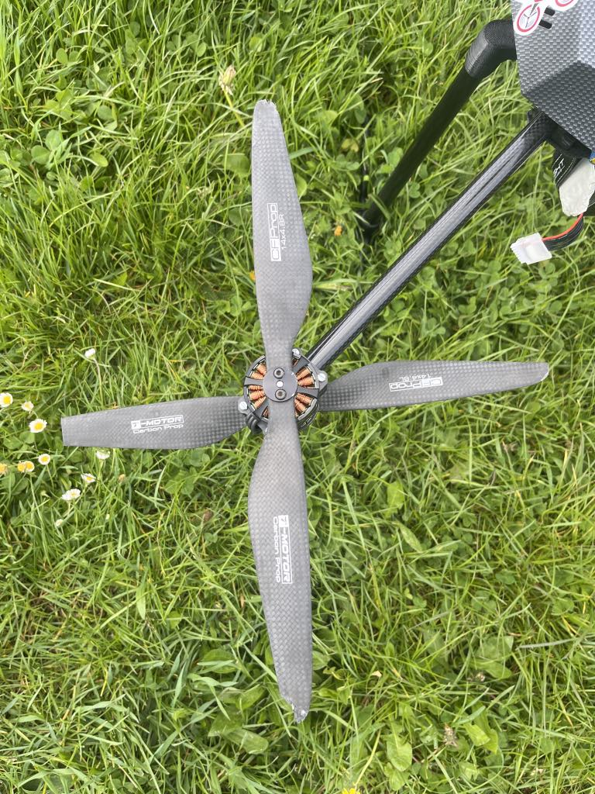
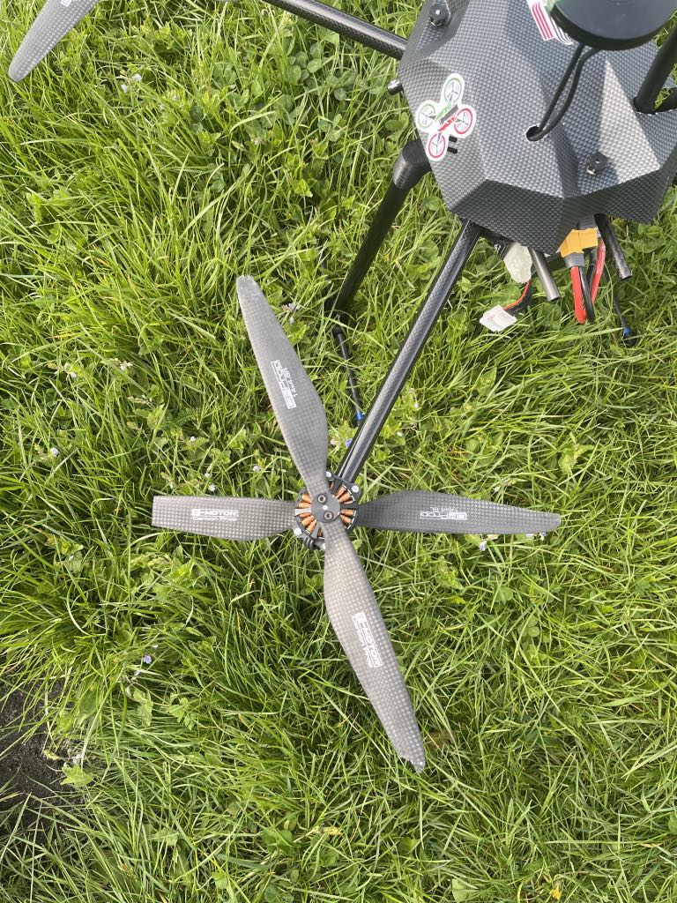
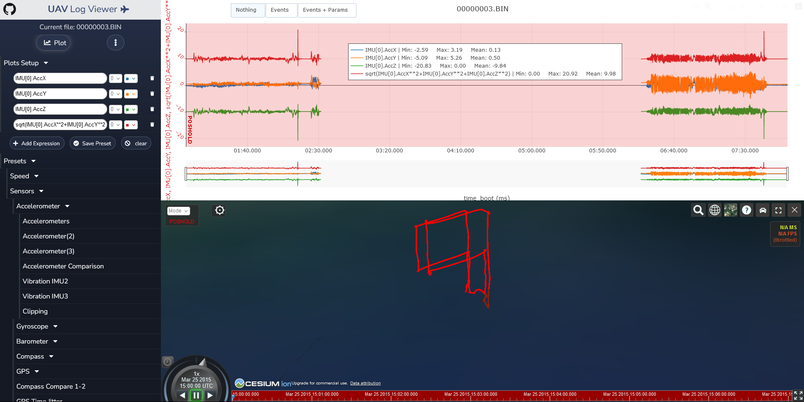

# Data Analytics
## Authors
- Bartosz Bartoszewski, 406690
- Kacper Jarzyna, 406369

# Detection of drone propeller damage
    We developed a program for detecting damage to drone propellers based on data from the accelerometer and gyroscope.

## 1. Use Case
    Technical state monitoring: The system can conduct real-time tests on the drone during its operation, identifying potential propeller damage during flight. This enables a quick response to any issues and prevents potential equipment damage.

## 2. Collecting Data

    The data was collected by our own. To gather data, flights were conducted using an eight-rotor drone. Initially, flights were carried out with all propellers in good condition, followed by series of flights with one damaged propeller measuring 1.5 cm in length. Subsequently, the damaged propeller was replaced with one measuring 3 cm in length, and the series of tests continued.

One propeller cuted 1.5 cm

One propeller cuted 3 cm

## 3. Data preprocessing
After collecting data, files from the `logs_from_flights` folder were replayed in the [UAV Log Viewer](https://plot.ardupilot.org/) program to export data from the gyroscope and accelerometer. This program was used because it allowed for a clear visualization of the drone's flight trajectory and ensured that the exported data corresponded to the appropriate flights with the relevant damages.

